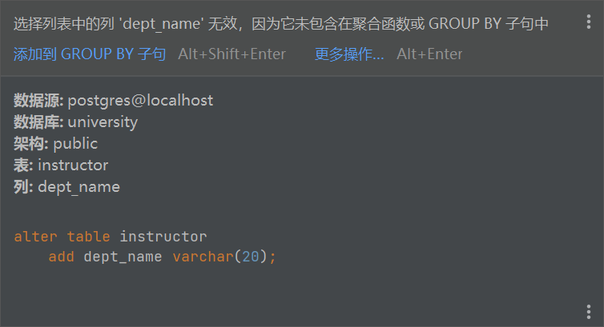
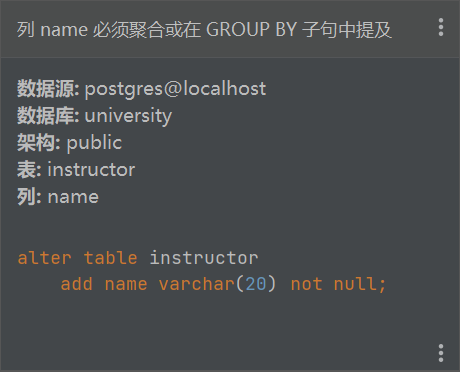
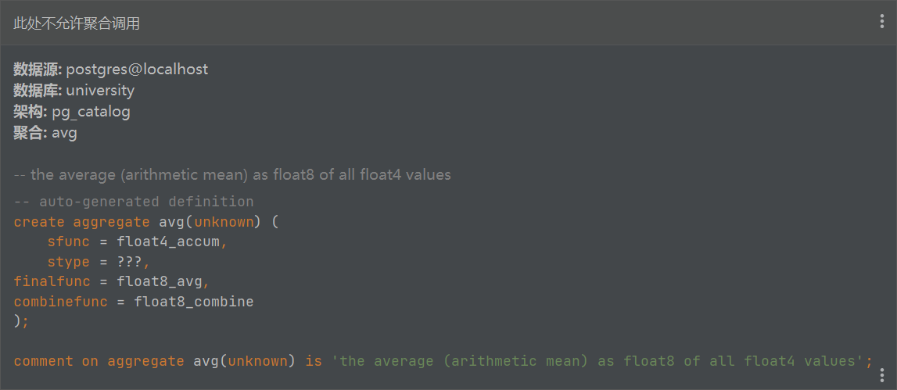

# 本周作业（第4次作业）

## 题目一（2分）
请问下面的SQL语句是否合法？用实验验证你的想法。你从实验结果能得到什么结论？

```sql
SELECT dept_name, min(salary)
FROM instructor;

SELECT dept_name, min(salary)
FROM instructor
GROUP BY dept_name
HAVING name LIKE '%at%';

SELECT dept_name
FROM instructor
WHERE AVG(salary) > 20000;
```

下面的三个语句均不合法。  
实验过程：





实验结论：
1. min(salary)是聚合函数，需要dept_name在GROUP BY子句中分组。
2. HAVING子句中引用了name字段，但name未在GROUP BY中出现，也未作为聚合函数参数。
3. AVG(salary)是聚合函数，不能在WHERE子句中使用。

## 题目二（3分+3分+2分）
1. 找到工资最高员工的名字，假设工资最高的员工只有一位（至少两种写法）。
### 写法1
```sql
SELECT name
FROM instructor
WHERE salary = (SELECT MAX(salary) FROM instructor);
```

### 写法2
```sql
SELECT name
FROM instructor
ORDER BY salary DESC
LIMIT 1;
```

2. 找到工资最高员工的名字，假设工资最高的员工有多位（试试多种写法）。
### 写法1
```sql
SELECT name
FROM instructor
WHERE salary = (SELECT MAX(salary) FROM instructor);
```

### 写法2 (多返回了salary)
```sql
SELECT name, salary
FROM instructor
GROUP BY name, salary
HAVING salary = (SELECT max(salary));
```

### 写法3
```sql
SELECT name
FROM instructor
WHERE salary >= ALL (SELECT salary FROM instructor);
```

3. 解释下面四句。

```sql
SELECT 1 IN (1);
SELECT 1 = (1);
SELECT (1, 2) = (1, 2);
SELECT (1) IN (1, 2);
```

```sql
SELECT 1 IN (1);       -- 返回 true（1在集合(1)中）
SELECT 1 = (1);        -- 返回 true（1等于标量值1）
SELECT (1, 2) = (1, 2); -- 返回 true（元组相等）
SELECT (1) IN (1, 2);  -- 返回 true（1在集合(1,2)中）
```