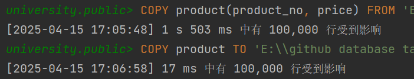

# 数据库作业五

## 题目一
### 1. 创建表并导入数据
```sql
-- 创建product表
CREATE TABLE product (
    product_no VARCHAR(100) PRIMARY KEY,
    price DECIMAL(10,2)
);
```


```sql
-- 数据存储在products.txt文件中，使用COPY命令导入
COPY product(product_no, price) FROM 'E:\\github database task\\product_data.csv' WITH CSV;
```



```sql
-- 导出数据（CSV格式）
COPY product TO 'E:\\github database task\\product_data_result.csv' DELIMITER ',' CSV HEADER;
```


## 题目二
```sql
-- 添加价格不详的商品
INSERT INTO product (product_no, name, price) VALUES (666, 'cake', NULL);

-- 同时添加3个商品
INSERT INTO product (product_no, name, price) 
VALUES 
    (777, 'coffee', 29.99),
    (888, 'tea', 19.99),
    (999, 'juice', 15.99);

-- 商品价格统一打8折
UPDATE product 
SET price = price * 0.8 
WHERE price IS NOT NULL;

-- 价格大于100上涨2%，其余上涨4%
UPDATE product 
SET price = CASE 
    WHEN price > 100 THEN price * 1.02
    ELSE price * 1.04
END
WHERE price IS NOT NULL;

-- 删除名字包含cake的商品
DELETE FROM product 
WHERE name LIKE '%cake%';

-- 删除价格高于平均价格的商品
DELETE FROM product 
WHERE price > (SELECT AVG(price) FROM product WHERE price IS NOT NULL);
```

## 题目三
```sql
-- 添加10万条商品数据
INSERT INTO product (name, price)
SELECT
    'Product' || generate_series,
    ROUND((random() * 1000)::numeric, 2)
FROM generate_series(1, 100000);

-- 性能测试：DELETE
BEGIN;
\timing
DELETE FROM product;
COMMIT;
```

```sql
-- 性能测试：TRUNCATE
BEGIN;
\timing
TRUNCATE TABLE product;
COMMIT;
```


DELETE和TRUNCATE的性能比较：
1. DELETE是DML（数据操作语言），会逐行删除数据并记录事务日志
2. TRUNCATE是DDL（数据定义语言），直接删除表数据页，效率更高
3. 通常TRUNCATE的执行速度比DELETE快很多，特别是在大数据量的情况下
