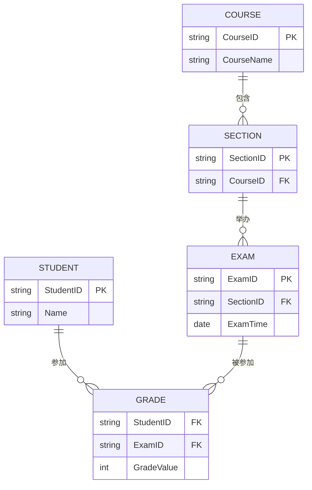

# 第8次数据库作业

## 题目一

### 1. 数据库描述
本数据库用于记录学生在不同课程段的不同考试中获得的成绩信息。涉及的主要实体有：学生（Student）、课程（Course）、课程段（Section）、考试（Exam）。

### 2. E-R图设计（Mermaid 语法）

### 3. 关系模式及主码

- **Student(StudentID, Name, …)**  
  主码：StudentID

- **Course(CourseID, CourseName, …)**  
  主码：CourseID

- **Section(SectionID, CourseID, …)**  
  主码：SectionID  
  外键：CourseID → Course

- **Exam(ExamID, SectionID, ExamTime, …)**  
  主码：ExamID  
  外键：SectionID → Section

- **Grade(StudentID, ExamID, GradeValue)**  
  主码：(StudentID, ExamID)  
  外键：StudentID → Student  
  外键：ExamID → Exam

---

## 题目二

**题目：如果一个关系模式中只有两个属性，证明该关系模式必定属于BCNF。**

**证明：**

设关系模式R(X, Y)，只有两个属性X和Y。

- 若存在非平凡函数依赖X → Y，则X为候选码（因为只有X和Y，X能唯一确定Y，且无其他属性）。
- 若存在Y → X，则Y为候选码。
- 若只有平凡依赖（如X → X, Y → Y），则无非平凡依赖，自动满足BCNF。

BCNF定义：对于每一个非平凡的函数依赖X → Y，X是超码。  
由于只有两个属性，任何非平凡依赖的决定属性必然是候选码或超码，因此必定属于BCNF。

---

## 题目三

**题目：关系模式r(A, B, C, D, E)，有如下函数依赖：**
- A → BC
- BC → E
- CD → AB

**请给出一个满足BCNF的分解，并说明你的分解符合BCNF。**

### 步骤1：求候选码

- A → BC，A能推出B、C
- BC → E，A能推出B、C，BC能推出E，所以A能推出E
- CD → AB，CD能推出A、B

尝试A和D闭包：
- (A, D)+ = {A, D, B, C, E}，能覆盖所有属性
- (C, D)+ = {C, D, A, B, E}，能覆盖所有属性

所以候选码有：AD, CD

### 步骤2：检查BCNF

- A → BC，A不是超码（A不是候选码），不满足BCNF
- BC → E，BC不是超码，不满足BCNF
- CD → AB，CD是候选码，满足BCNF

### 步骤3：分解

1. 以A → BC分解：
   - R1(A, B, C)
   - R2(A, D, E)

2. 检查R1(A, B, C)的依赖：
   - A → BC，A为候选码，满足BCNF

3. 检查R2(A, D, E)的依赖：
   - A → E，A不是超码，不满足BCNF
   - 继续分解R2，以A → E分解：
     - R3(A, E)
     - R4(A, D)

4. R3(A, E)：A为候选码，满足BCNF
5. R4(A, D)：只有两个属性，自动满足BCNF

### 最终分解结果

- R1(A, B, C)
- R3(A, E)
- R4(A, D)

**说明：**  
每个分解后的关系模式都满足BCNF，因为每个非平凡依赖的决定属性都是超码或候选码。

--- 